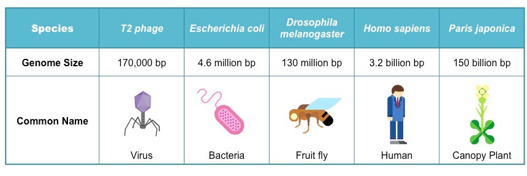

# Genotipagem de um cromossomo

>**Objetivo:** Identificar as variantes presentes nos dados fornecidos

>**Tempo de duração:** 12 horas

Nosso genoma (sim, de todos *Homo sapiens*) é muito grande, no sentido de que possui muitos nucleotideos em sua composição. Isso torna necessário o uso de muitos recursos computacionais para que a análise seja concluida em tempo hábil.

  

Imagem de: [https://ib.bioninja.com.au](https://ib.bioninja.com.au/standard-level/topic-3-genetics/32-chromosomes/genome-size.html)

A fim de tornar este desafio mais democrático optamos por disponibilizar apenas parte dos dados. Nesta etapa iremos disponiblizar os dados referentes ao cromossomo 22. Um genoma humano padrão possui 22 pares de cromossomos autossomicos e 1 par (X e Y) de cromossomos sexuais.

O cromossomo 22 não é o menor de nossos autossomicos, mas está entre eles.

> Não deixe de conferir os links para mais informações!

## 📦 Dados fornecidos

* 1 FASTA: sequencia de nucleotídeos do cromossomo 22. A mesma disponível em bancos publicos. Adicionaremos aqui apenas para conveniência.
    - Este arquivo é popularmente conhecido como "Genoma Referencia" quando contém os dados de todos os cromossomos da espécie. Caso queira baixar, ou esteja apenas curiosos a respeito, de uma olhada nos links no final desta página.
* 1 par de FASTQs: leituras de sequenciamento Illumina, biblioteca de sequenciamento preparada com kit de exomas.
* VCF - algumas variantes que esperamos que estejam no seu resultado final. Se elas estiverem ausentes é sinal de que algo na sua análise pode estar incorreto.

## 👷 Tarefa

Será divulgada no dia do desafio.

## 🔗 Links

- [Google Life Sciences - Genomas referência](https://cloud.google.com/life-sciences/docs/resources/public-datasets/reference-genomes)
  - Já faz algum tempo que o Google vem investindo no desenvolvimento de produtos dedicados a problemas biológicos. Neste link é possivel encontrar diferentes versões do genoma humano para download, bem como uma tabela com os dados e os metadados de projetos como 1,000 Genomas - no menu lateral.

- [t2t CHM13 - a versão mais completa do genoma humano](https://www.nature.com/articles/d41586-021-01506-w)
  - Em 2021 pesquisadores combinaram diversas tecnicas de sequenciamento para completar regiões problemáticas do genoma humano. Neste trabalho existem informações interessantes sobre as principais diferenças em relação a versão que hoje é a mais amplamente utilizada - a GRCh38.

- [Biostars - Discussão sobre genotipagem/chamada de variantes](https://www.biostars.org/p/277927)
  - Existe uma resposta bastante informativa onde Kevin Blighe discorre sobre as principais diferenças nos termos com base na experiencia dele. Também tem um apontamento importante sobre o contexto populacional que existe por trás da definição de SNP (Single Nucleotide Polimorfism). Nem toda variante é um SNP!