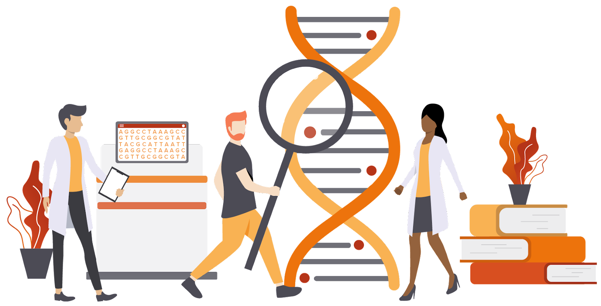

# Desafio LBB-Mendelics 2021

  

Parte da nossa rotina de trabalho na Mendelics é identificar variantes presentes em centenas de pacientes para auxiliar os médicos na tarefa de encontrar a causa genética de algumas patologias.

Nossa proposta para o [desafio LBB 2021](https://lbb.ime.usp.br/desafio/desafio-mendelics) consiste em executar parte dessa rotina e responder algumas perguntas baseadas nos resultados encontrados durante suas análises.

## 💭 Como será o desafio?

O desafio terá 3 etapas e ao longo da semana iremos disponibilizar os dados e mais informações nos respectivos diretórios. 

- 🚨 `28/10/2021` [Genotipagem de um cromossomo](Dia_1/README.md)

- `29/10/2021` [Métricas de qualidade](Dia_2/README.md)

- `30/10/2021` [Investigando as variantes](Dia_3/README.md)

## 🗃 Material de apoio

- [Dicas para desenvolvimento](dicas-desenvolvimento.md)

- [Pontuação](pontuacao.md)

- [Prêmios](premios.md)

## ❓ Dúvidas

Fique a vontade para iniciar uma discussão na aba [*"Discussions"*](https://github.com/mendelics/lbb-mendelics-2021/discussions) do GitHub.

## 👥 Recrutamento

Caso tenha interesse em trabalhar conosco envie seu currículo para:

Gupy: [Banco de Talentos - Pessoa #Bioinformata](https://mendelics.gupy.io/jobs/1273951?jobBoardSource=gupy_public_page)
